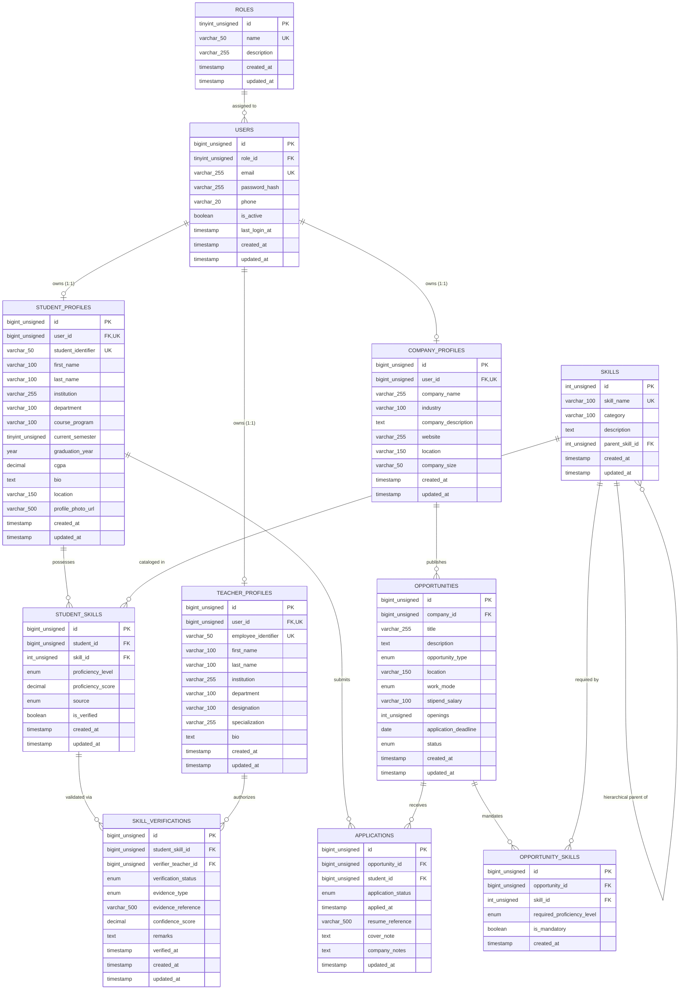

# SIH26044: Entity-Relationship (ER) Diagram & Schema Documentation
**Project:** Academia–Industry Collaboration Portal  
**Phase:** Phase 1 — Core Database Foundation  
**Database Engine:** MySQL 8.x (InnoDB, utf8mb4)  
**Environment:** XAMPP / phpMyAdmin / VS Code  

---

## 1. Visual Mermaid ER Diagram

---

## 2. Core Relational Architecture

### 1. User & Identity Layer
- **`roles`**: System master table with fixed roles: `student`, `company`, `teacher`, `admin`.
- **`users`**: Universal authentication root. Stores email, hashed password (bcrypt), activity status, and direct foreign key `role_id`.
  - **Decision Rationale:** A direct `role_id` foreign key on `users` was chosen over a separate `user_roles` junction table because each account possesses a distinct primary stakeholder identity in Phase 1. This prevents role-switching anomalies, reduces JOIN overhead on login lookups, and simplifies authorization middleware.

### 2. Stakeholder Profiles (1:1 with Users)
- **`student_profiles`**: Linked via `UNIQUE(user_id)`. Contains enrollment identifiers, academic institution, program, semester, graduation year, and CGPA. Does not duplicate authentication data.
- **`company_profiles`**: Linked via `UNIQUE(user_id)`. Stores corporate name, industry vertical, description, website, size, and headquarters.
- **`teacher_profiles`**: Linked via `UNIQUE(user_id)`. Stores faculty identifier, institution, department, academic designation, and domain specialization.

### 3. Skill Master Taxonomy & Provenance
- **`skills`**: Canonical skill directory. Prevents duplicate definitions using `UNIQUE(skill_name)`. Includes a self-referencing foreign key `parent_skill_id` enabling hierarchical ontology modeling (e.g. `SQL` -> `MySQL`, `JavaScript` -> `React`).
- **`student_skills`**: Resolves many-to-many relationship between students and skills. Enforces `UNIQUE(student_id, skill_id)`.
  - **AI Provenance Integrity Rule:** When `source = 'ai_extracted'`, `is_verified` remains `FALSE`. Official verification requires explicit authorization via `skill_verifications`.
- **`skill_verifications`**: Links `student_skills` to `teacher_profiles`. Teachers serve as the final human authority for skill credentialing. Supports `pending`, `approved`, and `rejected` statuses.

### 4. Opportunity & Recruitment Pipeline
- **`opportunities`**: Internship and employment postings created by corporate partners (`company_id`). Captures work mode, location, remuneration, openings, and application deadlines.
- **`opportunity_skills`**: Junction table binding opportunities to required skills. Enforces `UNIQUE(opportunity_id, skill_id)` and records minimum proficiency and mandatory/optional flags.
- **`applications`**: Tracks candidate lifecycle (`applied`, `shortlisted`, `interview`, `selected`, `rejected`, `withdrawn`). Enforces `UNIQUE(student_id, opportunity_id)` so a candidate can apply only once per posting.
