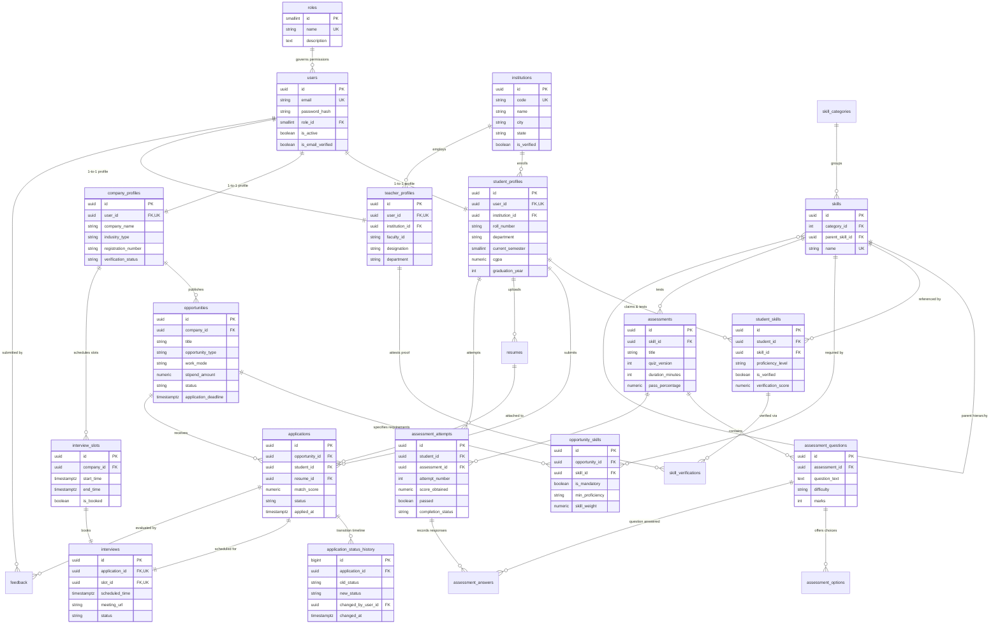

# Comprehensive Entity-Relationship (ER) Diagram
**Project:** SIH26044 – Academia–Industry Collaboration Portal  
**Document:** System-Wide Relational Architecture Model  
**Target Database:** PostgreSQL (v15+)  
**Role:** Database Architect  

---

## 1. Complete System Architecture Model

This diagram captures the complete data topology across all 5 core stakeholder flows: Students, Companies, Teachers, Institutions, and Platform Admins.



---

## 2. Key Cardinality Rules Visualized

### 2.1 The Closed-Loop Verification Triangle

```
        [Institutions]
         /          \
      (1:N)        (1:N)
       /              \
[student_profiles]   [teacher_profiles]
       \              /
      (M:N)        (Attests)
         \          /
       [student_skills] <── [skill_verifications]
```

### 2.2 The Hiring & Application Pipeline

```
[company_profiles] ──(1:N)──> [opportunities] ──(1:N)──> [applications] <──(1:N)── [student_profiles]
                                    │                           │
                                  (M:N)                       (1:1)
                                    │                           │
                                 [skills]                  [interviews]
                                                                │
                                                              (1:1)
                                                                │
                                                         [interview_slots]
```

---

## 3. Student Learning Corner: Reading ER Diagrams

> [!NOTE]
> ### Student Learning Corner: What, Why, and How
> 
> **WHAT are the symbols in Mermaid ER Diagrams?**
> - `||--||`: **One-to-One** (Exactly one record links to exactly one record, e.g. `users` to `student_profiles`).
> - `||--o{`: **One-to-Many** (One parent record has zero, one, or multiple children, e.g. `company_profiles` to `opportunities`).
> - `PK`: Primary Key (Unique row identity).
> - `FK`: Foreign Key (Link to a primary key in another table).
> - `UK`: Unique Key constraint (Prevents duplicate values).
> 
> **WHY do we create this diagram before writing APIs?**  
> When a frontend developer asks: *"How do I get the company name for an interview?"*, the ER diagram shows the path in 3 seconds:  
> `interviews` $\to$ `applications` $\to$ `opportunities` $\to$ `company_profiles.company_name`.  
> The diagram is your architectural roadmap!
