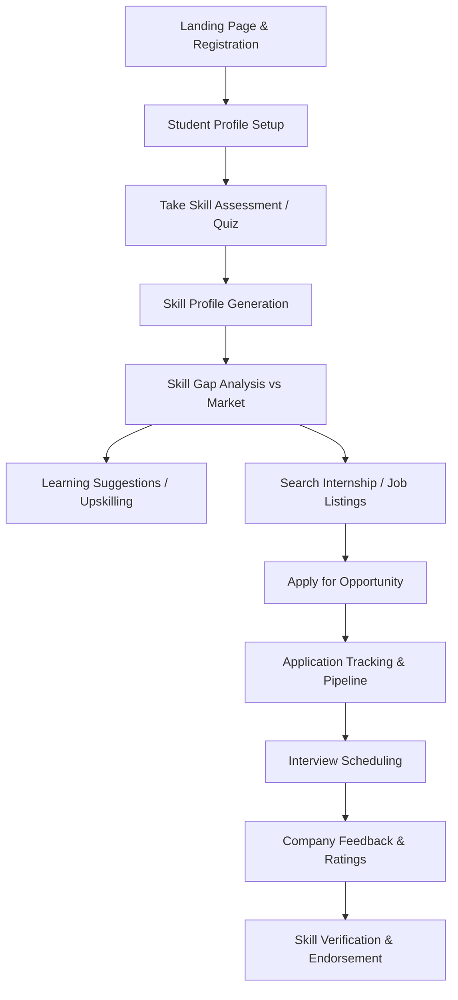
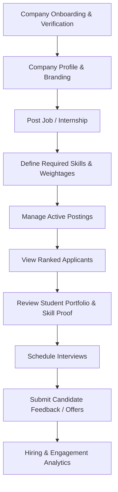
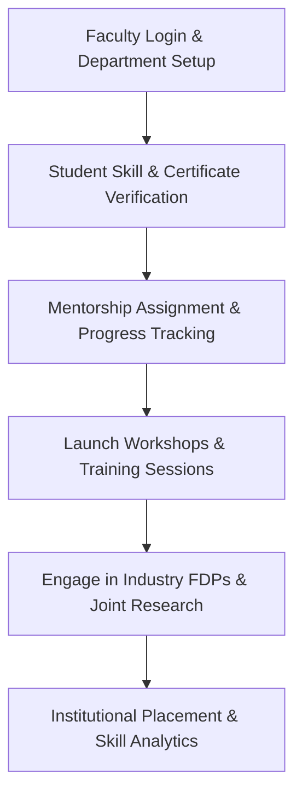

# 01. Database Requirements Analysis
**Project:** SIH26044 – Academia–Industry Collaboration Portal  
**Document:** Database Requirements Specification & Workflow Mapping  
**Target Database:** PostgreSQL (v15+)  
**Author:** Database Architect & Engineer Team  
**Audience:** Development Team & Student Learners  

---

## 1. Project Background & Objective

The **Academia–Industry Collaboration Portal (SIH26044)** is designed to bridge the structural gap between educational curricula and dynamic corporate skill requirements. Traditional platforms treat internships like static job boards. SIH26044 introduces a closed-loop ecosystem connecting five core stakeholders:

1. **Students:** Gain verifiable skills, evaluate skill gaps, discover curated learning paths, and secure verified internships and jobs.
2. **Companies / Industry Partners:** Post opportunities, evaluate candidate fit with automated skill-gap matching, access ranked applicant pools, and conduct structured interviews.
3. **Teachers / Faculty Mentors:** Verify student skills and external certifications, publish Faculty Development Programs (FDPs), engage in joint research/consultancy with industry, and monitor institutional talent progress.
4. **Institutions / Colleges:** Track overall cohort performance, NAAC/NIRF accreditation metrics, industry partnership tie-ups, and placement statistics.
5. **Platform Administrators:** Ensure platform integrity, verify company credentials, manage RBAC (Role-Based Access Control), and maintain audit logs.

---

## 2. Detailed Workflow Analysis & Requirement Mapping

Every user interaction in the application translates to reading, writing, or updating database records. Below is the breakdown of each major stakeholder workflow mapped to corresponding database responsibilities.

### 2.1 Student Workflow Mapping

| Step # | Workflow Step | Platform Action | Database Requirement | Candidate Entities |
|---|---|---|---|---|
| **ST-01** | Landing & Registration | Student signs up with email, password, and institutional affiliation. | Secure user identity creation, role assignment, email verification token generation. | `users`, `roles`, `institutions` |
| **ST-02** | Profile Setup | Fills academic details (USN/Roll No, branch, CGPA, graduation year, bio). | Store 1-to-1 profile attributes linked to user record; store portfolio links. | `student_profiles`, `institutions` |
| **ST-03** | Skill Quiz / Assessment | Selects a skill (e.g. Python, SQL) and answers timed MCQ or coding questions. | Store question bank, user assessment attempts, recorded responses, time taken, score calculation. | `assessments`, `assessment_questions`, `assessment_options`, `assessment_attempts`, `assessment_answers` |
| **ST-04** | Skill Profile | View verified vs self-reported skill levels (Beginner, Intermediate, Advanced). | Maintain normalized skills catalogue and student-skill relationship with proficiency levels. | `skills`, `skill_categories`, `student_skills` |
| **ST-05** | Skill Gap Analysis | Compares student's current skill profile against industry target profiles. | Query intersection and set difference between required opportunity skills and student skills. | `student_skills`, `opportunity_skills`, `skill_gap_recommendations` |
| **ST-06** | Learning Suggestions | Platform recommends courses, docs, or workshops based on missing skills. | Relational mapping between target skills and curated learning materials. | `learning_resources`, `skills` |
| **ST-07** | Listings & Discovery | Student searches and filters open internships/jobs by domain, stipend, location. | Filtered querying on active, non-expired opportunities with faceted search. | `opportunities`, `opportunity_skills`, `company_profiles` |
| **ST-08** | Apply | Submits resume, cover letter, and snapshot of verified skill score. | Create application record preventing duplicate submissions; snapshot current state. | `applications`, `resumes` |
| **ST-09** | Application Tracking | Checks status (Applied -> Shortlisted -> Interview Scheduled -> Selected -> Rejected). | Maintain status column plus historical event audit trail of stage transitions. | `applications`, `application_status_history` |
| **ST-10** | Interview Scheduling | Chooses an available slot provided by the company or receives meeting invite. | Manage interview calendars, timeslots, meeting links, and participant mapping. | `interviews`, `interview_slots` |
| **ST-11** | Feedback & Review | Receives structured performance feedback post-interview or post-internship. | Store qualitative and quantitative ratings from recruiter to student. | `feedback`, `applications` |
| **ST-12** | Skill Verification | Teacher or Company endorses student skill upon successful project/internship. | Verification log linking verifier (teacher/company) to student skill entry. | `skill_verifications`, `student_skills` |

---

### 2.2 Company Workflow Mapping

| Step # | Workflow Step | Platform Action | Database Requirement | Candidate Entities |
|---|---|---|---|---|
| **CO-01** | Company Onboarding | Company signs up with corporate email, GSTIN/CIN, website, and industry category. | Store company identity, administrative verification status (unverified, verified, suspended). | `users`, `company_profiles` |
| **CO-02** | Profile Management | Adds company description, logos, office locations, perks, company culture. | Store company metadata for public listing pages. | `company_profiles` |
| **CO-03** | Post Opportunity | Creates internship/job with title, description, stipend, deadline, vacancies. | Persist opportunity records with lifecycle states (draft, published, closed, archived). | `opportunities` |
| **CO-04** | Specify Skill Requirements | Selects required skills and minimum acceptable proficiency (e.g. Python: Intermediate). | Many-to-many association between opportunity and skills with importance weighting. | `opportunity_skills`, `skills` |
| **CO-05** | Applicant List & Ranking | Views candidates ordered by automated match score (based on verified skills & quiz results). | Compute match score via database join/query between candidate skills and required skills. | `applications`, `student_skills`, `opportunity_skills` |
| **CO-06** | Profile & Portfolio Inspection | Reviews candidate's GitHub, live projects, resumes, and verified test score. | Relational retrieval of student portfolio, uploaded certificates, and test attempt history. | `student_profiles`, `projects`, `certificates`, `resumes` |
| **CO-07** | Interview Scheduling | Proposes interview time slots, video links (Google Meet/Zoom), and assigns interviewers. | Store interview slots, slot status (booked, open), and interview booking details. | `interviews`, `interview_slots` |
| **CO-08** | Feedback & Offer Release | Submits rejection reasons or issues offer letters with stipend and joining date. | Application status updates, offer metadata storage, and structured review storage. | `applications`, `application_status_history`, `feedback` |
| **CO-09** | Analytics Dashboard | Views metrics: total views, application rate, time-to-hire, diversity statistics. | Aggregated read queries across opportunities, views, and applications. | Analytical views over `opportunities`, `applications` |

---

### 2.3 Teacher / Faculty Workflow Mapping

| Step # | Workflow Step | Platform Action | Database Requirement | Candidate Entities |
|---|---|---|---|---|
| **TE-01** | Faculty Login & Setup | Teacher registers under a specific institutional department and designation. | Link teacher profile to college institution and department domain. | `users`, `teacher_profiles`, `institutions` |
| **TE-02** | Skill Verification | Reviews student-submitted proof (project GitHub, hackathon win) and awards verified badge. | Record verification action, verifier user ID, timestamp, verification status (approved/rejected), comments. | `skill_verifications`, `student_skills`, `certificates` |
| **TE-03** | Mentorship Management | Mentors assigned students; monitors student applications, test scores, and weak areas. | Track mentor-mentee relationships and periodic advisory logs. | `mentorships`, `student_profiles`, `teacher_profiles` |
| **TE-04** | Training / Workshop Programs | Creates internal workshops or webinars to bridge identified student cohort skill gaps. | Store program schedules, syllabus, target skills, and enrolled students. | `programs`, `program_participants`, `skills` |
| **TE-05** | Faculty Development & Research | Explores industry consultancy listings or signs up for corporate-sponsored FDPs. | Store research projects, consultancy proposals, and teacher participation. | `consultancy_projects`, `programs` |
| **TE-06** | Department Analytics | Views cohort breakdown: % students job-ready, top missing skills in Computer Science, etc. | Aggregated reporting across student skills and placement outcomes. | Analytical queries over `student_skills`, `applications` |

---

### 2.4 Institution & Admin Workflow Mapping

| Step # | Workflow Step | Platform Action | Database Requirement | Candidate Entities |
|---|---|---|---|---|
| **AD-01** | Institution Accreditation & Verification | Verifies colleges (AISHE code, accreditation grade, official domain). | Store institution verification documents, contact admin, AISHE code unique constraint. | `institutions`, `admin_profiles` |
| **AD-02** | Role & Permission Administration | Manages RBAC permissions, suspends malicious users, reviews reported content. | User role assignment, account status tracking (`active`, `suspended`, `banned`). | `roles`, `users`, `audit_logs` |
| **AD-03** | System Audit & Compliance | Records critical security events (login, role change, data export) for compliance. | Immutable append-only audit trail logging actor, action, target, timestamp, IP. | `audit_logs` |

---

## 3. Student Learning Corner: Requirements to Database Translation

> [!NOTE]
> ### Student Learning Corner: What, Why, and How
> 
> **WHAT is Requirement-to-Database Mapping?**  
> In software engineering, users describe their needs in plain human language (e.g., *"A student should be able to view their test score"*). Requirement mapping is the discipline of translating that human sentence into concrete relational database constructs: **tables**, **columns**, **primary keys**, **foreign keys**, and **integrity constraints**.
> 
> **WHY do we need it?**  
> If you start writing database migration scripts or creating tables without mapping user workflows first, you will encounter severe bugs later:
> 1. You will forget required columns (e.g., forgetting to store the timestamp when an application was submitted).
> 2. You will choose the wrong relationships (e.g., forcing a student to have only one skill instead of many skills).
> 3. You will duplicate data across multiple tables (violating normalization).
> 
> **HOW does it apply to this project?**  
> Notice step **ST-09 (Application Tracking)**: A student wants to see how their application status changed from *Submitted* to *Shortlisted* to *Interview Scheduled*. If we only have a single column `status` in the `applications` table, every status update overwrites the old status! We would lose the historical record of when the student was shortlisted. Therefore, requirement analysis reveals that we need two entities:
> - `applications`: Stores the current status.
> - `application_status_history`: Stores every historical state change with timestamps and notes.

---

## 4. Summary of Functional Database Requirements

1. **Multi-Tenant Identity Architecture:** Single user entry point (`users`) with polymorphic profile segregation (`student_profiles`, `company_profiles`, `teacher_profiles`, `admin_profiles`).
2. **Normalized Skill Taxonomy:** Centralized skill dictionary (`skills`) grouped by categorizations (`skill_categories`) to prevent string typos like `"React"`, `"React.js"`, and `"reactjs"`.
3. **Assessment Engine:** Modular test structure supporting questions, options, automated scoring, and student attempt histories.
4. **Opportunity & Application Lifecycle Engine:** Full lifecycle tracking from draft to published, applicant intake, stage transitions, and rejection/offer recording.
5. **Two-Way Verification Engine:** Institutional validation of student skills by authorized faculty and corporate recruiters.
6. **Regulatory Audit Logging:** Append-only tracking for security and compliance audits.
