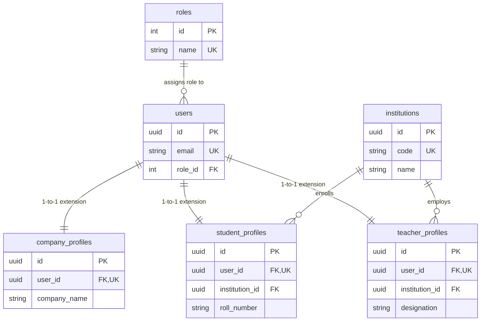
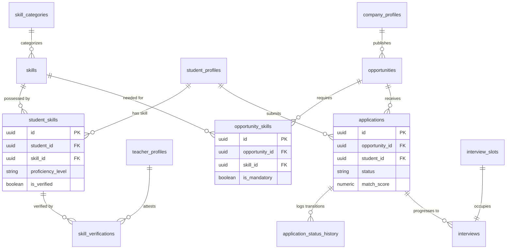
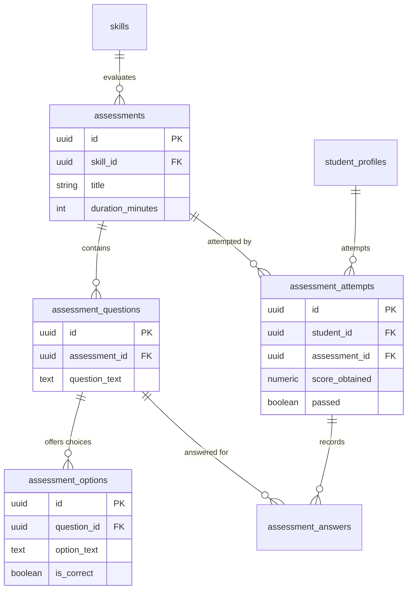

# 03. Database Relationships & Cardinality Analysis
**Project:** SIH26044 – Academia–Industry Collaboration Portal  
**Document:** Entity-Relationship Modeling, Cardinality, and Cascade Behaviors  
**Target Database:** PostgreSQL (v15+)  
**Author:** Database Architect & Engineer Team  
**Audience:** Development Team & Student Learners  

---

## 1. Relationship Cardinality Matrix

Cardinality defines the numerical relationship between two entities. In relational database design, we encounter three primary patterns:
* **One-to-One (1:1):** A record in Table A relates to exactly one record in Table B.
* **One-to-Many (1:N):** A record in Table A relates to zero, one, or multiple records in Table B.
* **Many-to-Many (M:N):** Multiple records in Table A relate to multiple records in Table B (resolved via a junction/associative table).

Below is the complete cardinality specification for the SIH26044 portal:

| Source Entity | Relationship Type | Target Entity | Foreign Key Column Location | On Delete Action | Business Reason & Integrity Rule |
|---|---|---|---|---|---|
| `roles` | **1 : N** | `users` | `users.role_id` | `ON DELETE RESTRICT` | Cannot delete a role if active users are assigned to it. |
| `institutions` | **1 : N** | `student_profiles` | `student_profiles.institution_id` | `ON DELETE RESTRICT` | An accredited college cannot be dropped if students are registered under it. |
| `institutions` | **1 : N** | `teacher_profiles` | `teacher_profiles.institution_id` | `ON DELETE RESTRICT` | Prevents accidental deletion of colleges with active faculty. |
| `users` | **1 : 1** | `student_profiles` | `student_profiles.user_id` (UNIQUE) | `ON DELETE CASCADE` | Deleting a student user account removes their student profile automatically. |
| `users` | **1 : 1** | `company_profiles` | `company_profiles.user_id` (UNIQUE) | `ON DELETE CASCADE` | Deleting a company user account removes company details. |
| `users` | **1 : 1** | `teacher_profiles` | `teacher_profiles.user_id` (UNIQUE) | `ON DELETE CASCADE` | Deleting a teacher user account cleans up their faculty profile. |
| `skill_categories`| **1 : N** | `skills` | `skills.category_id` | `ON DELETE RESTRICT` | Categories cannot be deleted if skills are mapped to them. |
| `student_profiles`| **M : N** | `skills` | Resolved via `student_skills` | `CASCADE` (student) / `RESTRICT` (skill) | A student has multiple skills; a skill has multiple students. |
| `student_skills` | **1 : N** | `skill_verifications` | `skill_verifications.student_skill_id` | `ON DELETE CASCADE` | Verification history tied directly to a student's skill record. |
| `teacher_profiles`| **1 : N** | `skill_verifications` | `skill_verifications.verified_by_user_id`| `ON DELETE SET NULL` | Verifier record preserved for audit even if teacher account is deactivated. |
| `company_profiles`| **1 : N** | `opportunities` | `opportunities.company_id` | `ON DELETE CASCADE` | If a company is removed, their posted opportunities are removed. |
| `opportunities` | **M : N** | `skills` | Resolved via `opportunity_skills`| `CASCADE` (opp) / `RESTRICT` (skill) | An opportunity requires multiple skills; a skill is needed by many opps. |
| `student_profiles`| **1 : N** | `applications` | `applications.student_id` | `ON DELETE CASCADE` | A student can apply to many opportunities. |
| `opportunities` | **1 : N** | `applications` | `applications.opportunity_id` | `ON DELETE RESTRICT` | Cannot delete an opportunity if student applications have been received. |
| `applications` | **1 : N** | `application_status_history` | `application_status_history.application_id` | `ON DELETE CASCADE` | Status history is an audit trail owned by the application. |
| `student_profiles`| **1 : N** | `resumes` | `resumes.student_id` | `ON DELETE CASCADE` | A student can upload multiple versions of their resume. |
| `applications` | **1 : 1** | `interviews` | `interviews.application_id` | `ON DELETE CASCADE` | An interview belongs to a specific candidate application. |
| `interview_slots`| **1 : 1** | `interviews` | `interviews.slot_id` (UNIQUE) | `ON DELETE RESTRICT` | An interview slot cannot be deleted while assigned to an active interview. |
| `assessments` | **1 : N** | `assessment_questions`| `assessment_questions.assessment_id` | `ON DELETE CASCADE` | Deleting a test deletes its questions. |
| `assessment_questions`| **1 : N**| `assessment_options` | `assessment_options.question_id` | `ON DELETE CASCADE` | Deleting a question removes its options. |
| `assessments` | **1 : N** | `assessment_attempts` | `assessment_attempts.assessment_id` | `ON DELETE RESTRICT` | Assessments with student attempt records cannot be deleted. |
| `assessment_attempts`| **1 : N**| `assessment_answers` | `assessment_answers.attempt_id` | `ON DELETE CASCADE` | Attempt answers belong strictly to the attempt. |

---

## 2. Visual Entity-Relationship Diagrams (Mermaid)

### 2.1 Core Identity & Profile Hierarchy

---

### 2.2 Skills, Opportunities & Applications Flow

---

### 2.3 Assessment Engine Structure

---

## 3. Student Learning Corner: Relationships & Referential Integrity

> [!NOTE]
> ### Student Learning Corner: What, Why, and How
> 
> **WHAT is Cardinality and a Junction Table?**  
> Cardinality describes "how many" records on one side connect to records on the other side.
> - When one student can have **many** skills, and one skill (like "PostgreSQL") can be shared by **many** students, this is a **Many-to-Many (M:N)** relationship.
> - Relational databases like PostgreSQL cannot directly link two tables in an M:N relationship with a single foreign key. Instead, we create a middle table called a **Junction Table** (also called associative table or bridge table). In our project, `student_skills` is the junction table connecting `student_profiles` and `skills`.
> 
> **WHY do On Delete behaviors (`CASCADE` vs `RESTRICT` vs `SET NULL`) matter?**  
> If you don't configure foreign key cascade rules properly, you risk corrupting your database:
> 1. `CASCADE`: If a student deletes their account (`users`), their `student_profiles`, `resumes`, and `student_skills` are deleted automatically. Leaving them behind would create "ghost" or orphaned records!
> 2. `RESTRICT`: If a company attempts to delete an internship posting that already has 50 student `applications`, PostgreSQL will throw an error and refuse to delete it! This protects student application data from disappearing without warning.
> 3. `SET NULL`: If a teacher who verified a student's certificate leaves the college and their user account is removed, we do NOT want to delete the student's verified badge! We set the `verified_by_user_id` to `NULL` while retaining the verification record and timestamp.
> 
> **HOW does it apply to this project?**  
> In `applications`, we add a unique constraint: `UNIQUE(opportunity_id, student_id)`.
> Without this constraint, an impatient student could click the "Apply" button 10 times in rapid succession, inserting 10 identical application rows for the same job! The unique constraint tells PostgreSQL at the database level: *"A student can apply to a specific opportunity at most ONCE."*
