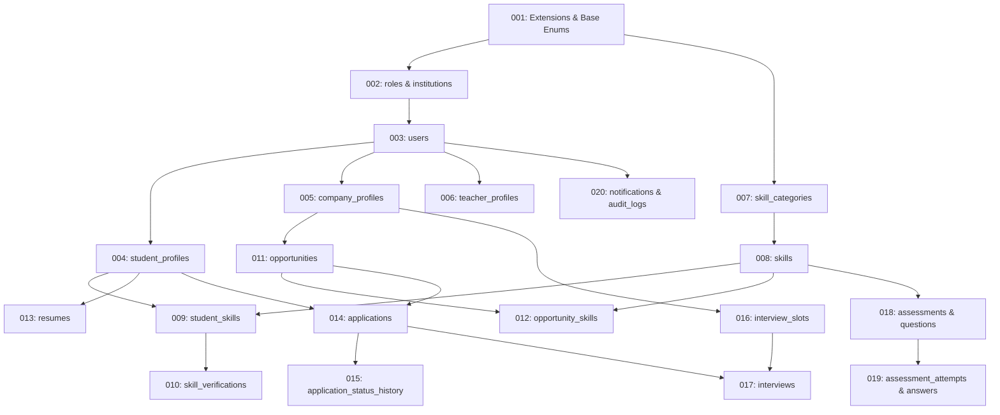

# 07. Database Implementation & Migration Plan
**Project:** SIH26044 – Academia–Industry Collaboration Portal  
**Document:** Proposed Migration Order, Naming Standards, Security & Performance Blueprints  
**Target Database:** PostgreSQL (v15+)  
**Author:** Database Architect & Engineer Team  
**Audience:** Development Team & Student Learners  

---

## 1. Proposed Migration Sequence

Database migrations must execute in a strict, deterministic sequence. Because tables reference each other using Foreign Keys, **a referenced parent table must always exist before the child table can be created**.

The dependency relationship forms a **Directed Acyclic Graph (DAG)**.



### Ordered Migration Execution Plan

| Migration Step | Migration File Name | Target Entities | Primary Purpose | Dependencies (Must Run After) |
|---|---|---|---|---|
| **001** | `001_init_extensions_and_enums.sql` | PostgreSQL extensions, ENUM types | Enable `pgcrypto`/UUID functions, create reusable enum types. | None |
| **002** | `002_create_roles_and_institutions.sql` | `roles`, `institutions` | Lookup tables for user roles and accredited colleges. | 001 |
| **003** | `003_create_users.sql` | `users` | Root authentication table with email, password hash, role FK. | 002 |
| **004** | `004_create_student_profiles.sql` | `student_profiles` | Student academic data linked to `users` and `institutions`. | 002, 003 |
| **005** | `005_create_company_profiles.sql` | `company_profiles` | Corporate identity and employer verification table. | 003 |
| **006** | `006_create_teacher_profiles.sql` | `teacher_profiles` | Faculty profile linked to `users` and `institutions`. | 002, 003 |
| **007** | `007_create_skill_categories.sql` | `skill_categories` | Categorization headers for technical and soft skills. | 001 |
| **008** | `008_create_skills.sql` | `skills` | Master canonical taxonomy of skills. | 007 |
| **009** | `009_create_student_skills.sql` | `student_skills` | Junction table linking students to skills with proficiencies. | 004, 008 |
| **010** | `010_create_skill_verifications.sql` | `skill_verifications` | Verification audit trail by faculty and testing engines. | 006, 009 |
| **011** | `011_create_opportunities.sql` | `opportunities` | Job, internship, and project listings published by companies. | 005 |
| **012** | `012_create_opportunity_skills.sql` | `opportunity_skills` | Junction table defining skills required for each opportunity. | 008, 011 |
| **013** | `013_create_resumes_and_portfolio.sql` | `resumes`, `projects`, `certificates` | Student uploaded documents and project showcase links. | 004 |
| **014** | `014_create_applications.sql` | `applications` | Core application submission linking student and opportunity. | 004, 011, 013 |
| **015** | `015_create_application_status_history.sql`| `application_status_history` | Audit log of application stage transitions. | 014 |
| **016** | `016_create_interview_slots.sql` | `interview_slots` | Recruiter calendar slots for scheduling interviews. | 005 |
| **017** | `017_create_interviews.sql` | `interviews`, `feedback` | Confirmed interviews and post-interview rating feedback. | 014, 016 |
| **018** | `018_create_assessments_and_questions.sql`| `assessments`, `assessment_questions`, `assessment_options` | Skill evaluation test banks and MCQ choices. | 008 |
| **019** | `019_create_assessment_attempts.sql` | `assessment_attempts`, `assessment_answers` | Student quiz test sessions, scores, and answer selections. | 004, 018 |
| **020** | `020_create_notifications_and_audit_logs.sql`| `notifications`, `audit_logs` | System alerts and security audit logging. | 003 |

---

## 2. Why Migration Order Matters: The Foreign Key Rule

If an engineer attempts to run `004_create_student_profiles.sql` before `003_create_users.sql`, PostgreSQL will immediately abort with this fatal error:

```
ERROR: relation "users" does not exist
LINE 4: REFERENCES users(id) ON DELETE CASCADE
```

### Principles of Migration Sequencing:
1. **Parents before Children:** A table being referenced by a Foreign Key must be created before the table that holds the foreign key.
2. **Extensions First:** System extensions (`pgcrypto`, `uuid-ossp`) must be enabled in migration `001` before any table attempts to call `gen_random_uuid()`.
3. **Idempotency:** Every migration script must be replayable or safely trackable via a migration management table (`_migrations` or Prisma/Drizzle migration history).
4. **Reversible (Up & Down):** In development, every migration should ideally have an accompanying rollback script (e.g. `DROP TABLE IF EXISTS student_skills CASCADE;`).

---

## 3. Database Naming Conventions

Consistency in naming avoids bugs when writing queries and ORM models:

| Element | Standard | Good Example | Bad Example | Rationale |
|---|---|---|---|---|
| **Table Names** | Lowercase, snake_case, **Plural** | `student_profiles`, `skills` | `StudentProfile`, `tbl_skill` | Follows standard relational conventions; represents collections. |
| **Primary Key** | Lowercase, singular `id` | `id` | `student_profile_id`, `PK_ID` | Clean and standardized across all entities. |
| **Foreign Key** | Singular target entity + `_id` | `user_id`, `opportunity_id` | `fk_user`, `user`, `opportunityID` | Immediately reveals target table and relational intent. |
| **Junction Tables**| Plural combination or domain name | `student_skills`, `opportunity_skills` | `students_skills_map` | Clear pairing of entities. |
| **Boolean Columns**| Prefix with `is_` or `has_` | `is_active`, `is_verified`, `has_passed`| `active`, `verified_flag` | Explicitly conveys true/false nature in code. |
| **Timestamp Columns**| Suffix with `_at` | `created_at`, `updated_at`, `applied_at` | `create_date`, `time_stamp` | Distinguishes datetimes from pure dates (`issue_date`). |

---

## 4. Security Blueprint

1. **Authentication & Secret Isolation:**
   - No plaintext passwords permitted in the schema.
   - Password hashes stored in `users.password_hash` using salted **Argon2id** or **Bcrypt**.
   - Session tokens (JWT refresh tokens, password reset tokens) must be hashed if stored in the database.
2. **Access Control (RBAC):**
   - Application layer and database queries must strictly verify the user's role before accessing records.
   - Example: A student cannot query other students' `resumes` or update `opportunity_skills`.
3. **Document Security:**
   - Resume and certificate URLs must point to signed, time-limited private object storage URLs (e.g. Amazon S3 Pre-Signed URLs) rather than publicly readable buckets.
4. **Audit Trail:**
   - Sensitive administrative operations (verifying a company, banning a user, manual skill score modifications) must trigger an insertion into `audit_logs` capturing `user_id`, `ip_address`, `action`, and previous vs new states in `details (JSONB)`.

---

## 5. Performance & Indexing Strategy

### Candidate Indexes for High-Frequency Queries

| Query Pattern | Affected Table | Proposed Index | Type | Performance Goal |
|---|---|---|---|---|
| **User Login** | `users` | `UNIQUE INDEX (email)` | B-Tree | $O(1)$ instantaneous user credential lookup. |
| **Browse Active Opportunities** | `opportunities` | `INDEX idx_opps_status_created (status, created_at DESC)` | B-Tree (Composite) | Fast pagination of active job/internship listings. |
| **Opportunity Matching by Skill** | `opportunity_skills` | `INDEX idx_opp_skills_skill_id (skill_id)` | B-Tree | High-speed join between student skills and job requirements. |
| **Student Skill Lookup** | `student_skills` | `INDEX idx_student_skills_student (student_id)` | B-Tree | Instant rendering of student dashboard and skill radar. |
| **Opportunity Applicants** | `applications` | `INDEX idx_apps_opp_score (opportunity_id, match_score DESC)` | B-Tree (Composite) | Ranked candidate leaderboard for recruiters without table scan. |
| **Student Application Tracking** | `applications` | `INDEX idx_apps_student_id (student_id)` | B-Tree | Instant retrieval of a student's personal applied list. |
| **Full-Text Job Search** | `opportunities` | `INDEX idx_opp_title_desc ON opportunities USING GIN (to_tsvector('english', title \|\| ' ' \|\| description))` | GIN (Generalized Inverted Index) | Sub-millisecond keyword searching for job titles and skills. |

---

## 6. Recommended Development Tooling

* **PostgreSQL Server:** Version 15 or 16 running locally or via Docker Compose.
* **Database GUI / Inspection:** pgAdmin 4 or DBeaver Community Edition.
* **Migration & ORM Frameworks:**
  * For TypeScript/Node.js: **Prisma ORM** or **Drizzle ORM** (lightweight, SQL-like, type-safe).
  * For Python/FastAPI/Django: **Alembic / SQLAlchemy** or Django native migrations.
  * For Raw SQL control: **Flyway** or **db-migrate**.

---

## 7. Student Learning Corner: Migrations & Indexing

> [!NOTE]
> ### Student Learning Corner: What, Why, and How
> 
> **WHAT is a Database Migration?**  
> A database migration is version control for your database schema. Just like Git tracks changes to your code, migrations track changes to your tables, columns, and constraints over time through incremental, numbered SQL scripts (e.g., `001_initial.sql`, `002_add_phone.sql`).
> 
> **WHY do we never create tables manually in a GUI without migration files?**  
> If you create tables by clicking buttons in pgAdmin without saving migration scripts:
> 1. When your teammate clones the repository, their database will be empty, and they cannot run the project.
> 2. When you deploy the project to the cloud for the SIH hackathon evaluation, you will have no automated way to replicate your database structure!
> Migrations ensure that anyone can reproduce the exact same database in 5 seconds by running one command.
> 
> **HOW does an Index speed up queries?**  
> Imagine a textbook with 1,000 pages. If you want to find the topic "Binary Search", without an index you would have to flip through all 1,000 pages one by one (a **Full Table Scan**). But with the Alphabetical Index at the back of the book, you look up "B", find the exact page number 412, and jump straight there. A database B-Tree index does the exact same thing for your SQL queries!
