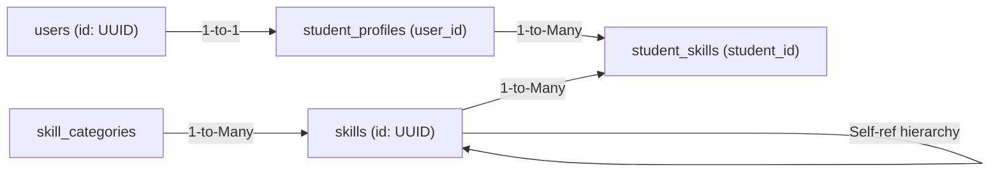
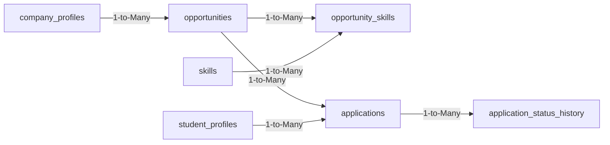

# PHASE 3 REPORT — BUILD DATABASE FOUNDATION
**Project:** SIH26044 – Academia–Industry Collaboration Portal  
**Document:** Master Phase 3 Implementation, Migration, Seed & Validation Report  
**Target Database:** PostgreSQL (v15+)  
**Role:** PostgreSQL Database Engineer  

---

## Executive Summary

Phase 3 ("Build Database Foundation") of the SIH26044 Academia–Industry Collaboration Portal is now complete. During this phase, the abstract design contracts established in Phase 2 have been translated into **13 discrete, numbered PostgreSQL migrations**, comprehensive deterministic **seed data**, four high-performance **production SQL queries**, an **automated validation suite**, and an **all-in-one execution pipeline**.

Every table, constraint, foreign key, index, and relational cascade was created following strict PostgreSQL conventions.

---

## Section 1: Detailed Table Specifications

### 1. `roles` (Migration 001)
* **Purpose:** Stores the 5 core system roles governing Role-Based Access Control (RBAC).
* **Columns:**
  * `id`: `SMALLINT GENERATED ALWAYS AS IDENTITY`, PRIMARY KEY
  * `name`: `VARCHAR(50)`, UNIQUE, NOT NULL
  * `description`: `TEXT`
  * `created_at`: `TIMESTAMPTZ`, NOT NULL, DEFAULT `NOW()`
* **Primary Key:** `roles_pkey (id)`
* **Foreign Keys:** None (Root lookup table).
* **Relationships:** 1-to-Many with `users`.
* **Constraints:** `UNIQUE(name)`
* **Indexes:** Automatically indexed on `id` (PK) and `name` (Unique B-Tree).
* **Seed Data:** 5 records (`student`, `teacher`, `company`, `institution`, `admin`).

---

### 2. `users` (Migration 002)
* **Purpose:** Root identity and authentication store for all system actors.
* **Columns:**
  * `id`: `UUID`, PRIMARY KEY, DEFAULT `gen_random_uuid()`
  * `role_id`: `SMALLINT`, NOT NULL, FOREIGN KEY REFERENCES `roles(id)` ON DELETE RESTRICT
  * `email`: `VARCHAR(255)`, UNIQUE, NOT NULL
  * `password_hash`: `VARCHAR(255)`, NOT NULL (Never plaintext)
  * `phone`: `VARCHAR(20)`
  * `is_active`: `BOOLEAN`, NOT NULL, DEFAULT `TRUE`
  * `created_at`: `TIMESTAMPTZ`, NOT NULL, DEFAULT `NOW()`
  * `updated_at`: `TIMESTAMPTZ`, NOT NULL, DEFAULT `NOW()`
  * `last_login_at`: `TIMESTAMPTZ`
* **Primary Key:** `users_pkey (id)`
* **Foreign Keys:** `role_id -> roles(id)` with `ON DELETE RESTRICT` (cannot delete a role while assigned to active users).
* **Relationships:** 1-to-1 with `student_profiles`, `company_profiles`, and `teacher_profiles`.
* **Constraints:** `UNIQUE(email)`
* **Indexes:** `idx_users_email` (B-Tree), `idx_users_role_id` (B-Tree).
* **Seed Data:** 10 accounts (4 students, 3 companies, 3 faculty members).

---

### 3. `institutions` (Migration 003)
* **Purpose:** Stores accredited colleges, universities, and polytechnics.
* **Columns:**
  * `id`: `UUID`, PRIMARY KEY, DEFAULT `gen_random_uuid()`
  * `name`: `VARCHAR(255)`, NOT NULL
  * `code`: `VARCHAR(50)`, UNIQUE, NOT NULL (AISHE Code)
  * `website`: `VARCHAR(255)`
  * `city`: `VARCHAR(100)`, NOT NULL
  * `state`: `VARCHAR(100)`, NOT NULL
  * `is_verified`: `BOOLEAN`, NOT NULL, DEFAULT `FALSE`
  * `created_at`: `TIMESTAMPTZ`, NOT NULL, DEFAULT `NOW()`
  * `updated_at`: `TIMESTAMPTZ`, NOT NULL, DEFAULT `NOW()`
* **Primary Key:** `institutions_pkey (id)`
* **Foreign Keys:** None.
* **Relationships:** 1-to-Many with `student_profiles` and `teacher_profiles`.
* **Constraints:** `UNIQUE(code)`
* **Indexes:** `idx_institutions_code` (B-Tree).
* **Seed Data:** 2 institutions (Delhi Technological University, IIT Bombay).

---

### 4. `student_profiles` (Migration 004)
* **Purpose:** Academic and demographic records for enrolled student users.
* **Columns:**
  * `id`: `UUID`, PRIMARY KEY, DEFAULT `gen_random_uuid()`
  * `user_id`: `UUID`, NOT NULL, UNIQUE, FOREIGN KEY REFERENCES `users(id)` ON DELETE CASCADE
  * `institution_id`: `UUID`, NOT NULL, FOREIGN KEY REFERENCES `institutions(id)` ON DELETE RESTRICT
  * `first_name`: `VARCHAR(100)`, NOT NULL
  * `last_name`: `VARCHAR(100)`, NOT NULL
  * `roll_number`: `VARCHAR(50)`, NOT NULL
  * `department`: `VARCHAR(100)`, NOT NULL
  * `current_semester`: `SMALLINT`, NOT NULL, CHECK (`current_semester BETWEEN 1 AND 12`)
  * `cgpa`: `NUMERIC(4, 2)`, CHECK (`cgpa >= 0.00 AND cgpa <= 10.00`)
  * `graduation_year`: `INT`, NOT NULL, CHECK (`graduation_year >= 2020 AND graduation_year <= 2040`)
  * `headline`: `VARCHAR(255)`, `bio`: `TEXT`, `github_url`: `VARCHAR(255)`, `linkedin_url`: `VARCHAR(255)`, `portfolio_url`: `VARCHAR(255)`
  * `created_at`: `TIMESTAMPTZ`, NOT NULL, DEFAULT `NOW()`, `updated_at`: `TIMESTAMPTZ`, NOT NULL, DEFAULT `NOW()`
* **Primary Key:** `student_profiles_pkey (id)`
* **Foreign Keys:** `user_id -> users(id)` (CASCADE), `institution_id -> institutions(id)` (RESTRICT).
* **Relationships:** 1-to-1 with `users`, Many-to-1 with `institutions`, 1-to-Many with `student_skills` and `applications`.
* **Constraints:** `UNIQUE(user_id)`, `UNIQUE(institution_id, roll_number)`, range checks on CGPA, semester, and graduation year.
* **Indexes:** `idx_student_profiles_user_id`, `idx_student_profiles_inst_id`.
* **Seed Data:** 4 students (Rahul Sharma, Priya Patel, Amit Verma, Sneha Reddy).

---

### 5. `company_profiles` (Migration 005)
* **Purpose:** Verified corporate employers recruiting student talent.
* **Columns:**
  * `id`: `UUID`, PRIMARY KEY, DEFAULT `gen_random_uuid()`
  * `user_id`: `UUID`, NOT NULL, UNIQUE, FOREIGN KEY REFERENCES `users(id)` ON DELETE CASCADE
  * `company_name`: `VARCHAR(255)`, NOT NULL
  * `industry_type`: `VARCHAR(100)`, NOT NULL
  * `website`: `VARCHAR(255)`, `registration_number`: `VARCHAR(100)`, `company_size`: `VARCHAR(50)`, `headquarters`: `VARCHAR(255)`, `description`: `TEXT`, `logo_url`: `VARCHAR(500)`
  * `verification_status`: `VARCHAR(50)`, NOT NULL, DEFAULT `'pending'`
  * `created_at`: `TIMESTAMPTZ`, NOT NULL, DEFAULT `NOW()`, `updated_at`: `TIMESTAMPTZ`, NOT NULL, DEFAULT `NOW()`
* **Primary Key:** `company_profiles_pkey (id)`
* **Foreign Keys:** `user_id -> users(id)` (CASCADE).
* **Relationships:** 1-to-1 with `users`, 1-to-Many with `opportunities`.
* **Constraints:** `UNIQUE(user_id)`, `CHECK (verification_status IN ('pending', 'verified', 'rejected'))`.
* **Indexes:** `idx_company_profiles_user_id`, `idx_company_profiles_verification`.
* **Seed Data:** 3 companies (TechCorp Solutions, CloudScale Networks, Quantum AI Labs).

---

### 6. `teacher_profiles` (Migration 006)
* **Purpose:** Academic faculty credentials, department affiliation, and verification authority.
* **Columns:**
  * `id`: `UUID`, PRIMARY KEY, DEFAULT `gen_random_uuid()`
  * `user_id`: `UUID`, NOT NULL, UNIQUE, FOREIGN KEY REFERENCES `users(id)` ON DELETE CASCADE
  * `institution_id`: `UUID`, NOT NULL, FOREIGN KEY REFERENCES `institutions(id)` ON DELETE RESTRICT
  * `first_name`: `VARCHAR(100)`, NOT NULL, `last_name`: `VARCHAR(100)`, NOT NULL
  * `faculty_id`: `VARCHAR(50)`, `designation`: `VARCHAR(100)`, NOT NULL, `department`: `VARCHAR(100)`, NOT NULL, `specialization`: `VARCHAR(255)`, `bio`: `TEXT`
  * `created_at`: `TIMESTAMPTZ`, NOT NULL, DEFAULT `NOW()`, `updated_at`: `TIMESTAMPTZ`, NOT NULL, DEFAULT `NOW()`
* **Primary Key:** `teacher_profiles_pkey (id)`
* **Foreign Keys:** `user_id -> users(id)` (CASCADE), `institution_id -> institutions(id)` (RESTRICT).
* **Constraints:** `UNIQUE(user_id)`.
* **Indexes:** `idx_teacher_profiles_user_id`, `idx_teacher_profiles_inst_id`.
* **Seed Data:** 3 teachers (Dr. Rajesh Kumar, Dr. Anita Desai, Prof. Vikram Singh).

---

### 7. `skill_categories` (Migration 007)
* **Purpose:** High-level domains of skills.
* **Columns:**
  * `id`: `INT GENERATED ALWAYS AS IDENTITY`, PRIMARY KEY
  * `name`: `VARCHAR(100)`, UNIQUE, NOT NULL
  * `description`: `TEXT`, `created_at`: `TIMESTAMPTZ`, NOT NULL, DEFAULT `NOW()`
* **Primary Key:** `skill_categories_pkey (id)`
* **Relationships:** 1-to-Many with `skills`.
* **Constraints:** `UNIQUE(name)`.
* **Seed Data:** 5 categories (Programming, Web Development, Databases, Cloud & DevOps, Artificial Intelligence).

---

### 8. `skills` (Migration 008)
* **Purpose:** Master canonical skill dictionary supporting parent-child hierarchy (`parent_skill_id`).
* **Columns:**
  * `id`: `UUID`, PRIMARY KEY, DEFAULT `gen_random_uuid()`
  * `category_id`: `INT`, NOT NULL, FOREIGN KEY REFERENCES `skill_categories(id)` ON DELETE RESTRICT
  * `parent_skill_id`: `UUID`, NULL, FOREIGN KEY REFERENCES `skills(id)` ON DELETE SET NULL
  * `name`: `VARCHAR(100)`, UNIQUE, NOT NULL
  * `description`: `TEXT`, `created_at`: `TIMESTAMPTZ`, NOT NULL, DEFAULT `NOW()`
* **Primary Key:** `skills_pkey (id)`
* **Foreign Keys:** `category_id -> skill_categories(id)`, `parent_skill_id -> skills(id)`.
* **Relationships:** Many-to-Many with `student_profiles` and `opportunities`.
* **Constraints:** `UNIQUE(name)`.
* **Indexes:** `idx_skills_category_id`, `idx_skills_parent_id`.
* **Seed Data:** 12 skills (Python, Java, JavaScript, React, Node.js, PostgreSQL, Redis, Docker, Git, Kubernetes, Machine Learning, Deep Learning).

---

### 9. `student_skills` (Migration 009)
* **Purpose:** Junction table storing claimed and verified student skills, numerical proficiencies, and confidence ratings.
* **Columns:**
  * `id`: `UUID`, PRIMARY KEY, DEFAULT `gen_random_uuid()`
  * `student_id`: `UUID`, NOT NULL, FOREIGN KEY REFERENCES `student_profiles(id)` ON DELETE CASCADE
  * `skill_id`: `UUID`, NOT NULL, FOREIGN KEY REFERENCES `skills(id)` ON DELETE RESTRICT
  * `proficiency`: `SMALLINT`, NOT NULL, DEFAULT `1`, CHECK (`proficiency BETWEEN 1 AND 5`)
  * `assessment_score`: `NUMERIC(5, 2)`, CHECK (`assessment_score >= 0.00 AND assessment_score <= 100.00`)
  * `source`: `VARCHAR(50)`, NOT NULL, DEFAULT `'self_reported'`, CHECK (`source IN ('self_reported', 'quiz_assessment', 'teacher_endorsement', 'industry_project')`)
  * `confidence_score`: `NUMERIC(3, 2)`, DEFAULT `0.50`, CHECK (`confidence_score >= 0.00 AND confidence_score <= 1.00`)
  * `is_verified`: `BOOLEAN`, NOT NULL, DEFAULT `FALSE`
  * `last_updated_at`: `TIMESTAMPTZ`, NOT NULL, DEFAULT `NOW()`, `created_at`: `TIMESTAMPTZ`, NOT NULL, DEFAULT `NOW()`
* **Primary Key:** `student_skills_pkey (id)`
* **Foreign Keys:** `student_id -> student_profiles(id)` (CASCADE), `skill_id -> skills(id)` (RESTRICT).
* **Constraints:** `UNIQUE(student_id, skill_id)` (prevents duplicate skill claims).
* **Indexes:** `idx_student_skills_student_id`, `idx_student_skills_skill_id`.
* **Seed Data:** 13 student-skill pairings across the 4 students.

---

### 10. `opportunities` (Migration 010)
* **Purpose:** Internships and jobs published by companies.
* **Columns:**
  * `id`: `UUID`, PRIMARY KEY, DEFAULT `gen_random_uuid()`
  * `company_id`: `UUID`, NOT NULL, FOREIGN KEY REFERENCES `company_profiles(id)` ON DELETE CASCADE
  * `title`: `VARCHAR(255)`, NOT NULL
  * `opportunity_type`: `VARCHAR(50)`, NOT NULL, DEFAULT `'internship'`
  * `work_mode`: `VARCHAR(50)`, NOT NULL, DEFAULT `'remote'`
  * `location`: `VARCHAR(255)`
  * `stipend`: `NUMERIC(10, 2)`, NOT NULL, DEFAULT `0.00`, CHECK (`stipend >= 0.00`)
  * `currency`: `VARCHAR(10)`, NOT NULL, DEFAULT `'INR'`
  * `duration_months`: `INT`, DEFAULT `6`, CHECK (`duration_months > 0`)
  * `deadline`: `TIMESTAMPTZ`, NOT NULL
  * `openings`: `INT`, NOT NULL, DEFAULT `1`, CHECK (`openings > 0`)
  * `status`: `VARCHAR(50)`, NOT NULL, DEFAULT `'active'`
  * `description`: `TEXT`, NOT NULL, `requirements`: `TEXT`
  * `created_at`: `TIMESTAMPTZ`, NOT NULL, DEFAULT `NOW()`, `updated_at`: `TIMESTAMPTZ`, NOT NULL, DEFAULT `NOW()`
* **Primary Key:** `opportunities_pkey (id)`
* **Foreign Keys:** `company_id -> company_profiles(id)` (CASCADE).
* **Constraints:** `chk_opp_type`, `chk_opp_work_mode`, `chk_opp_status`, `openings > 0`, `stipend >= 0.00`.
* **Indexes:** `idx_opps_company_id`, `idx_opps_status_deadline`.
* **Seed Data:** 6 opportunities (TechCorp: 3, CloudScale: 1, Quantum AI: 2).

---

### 11. `opportunity_skills` (Migration 011)
* **Purpose:** Junction table defining required skills, proficiency thresholds (1-5), and mathematical weights for each opening.
* **Columns:**
  * `id`: `UUID`, PRIMARY KEY, DEFAULT `gen_random_uuid()`
  * `opportunity_id`: `UUID`, NOT NULL, FOREIGN KEY REFERENCES `opportunities(id)` ON DELETE CASCADE
  * `skill_id`: `UUID`, NOT NULL, FOREIGN KEY REFERENCES `skills(id)` ON DELETE RESTRICT
  * `required_proficiency`: `SMALLINT`, NOT NULL, DEFAULT `3`, CHECK (`required_proficiency BETWEEN 1 AND 5`)
  * `is_mandatory`: `BOOLEAN`, NOT NULL, DEFAULT `TRUE`
  * `skill_weight`: `NUMERIC(3, 2)`, NOT NULL, DEFAULT `1.00`, CHECK (`skill_weight > 0.00`)
* **Primary Key:** `opportunity_skills_pkey (id)`
* **Foreign Keys:** `opportunity_id -> opportunities(id)` (CASCADE), `skill_id -> skills(id)` (RESTRICT).
* **Constraints:** `UNIQUE(opportunity_id, skill_id)`.
* **Indexes:** `idx_opp_skills_opp_id`, `idx_opp_skills_skill_id`.
* **Seed Data:** 16 skill requirements mapped to the 6 opportunities.

---

### 12. `applications` (Migration 012)
* **Purpose:** Records student job applications, calculated match scores, and status stages.
* **Columns:**
  * `id`: `UUID`, PRIMARY KEY, DEFAULT `gen_random_uuid()`
  * `opportunity_id`: `UUID`, NOT NULL, FOREIGN KEY REFERENCES `opportunities(id)` ON DELETE RESTRICT
  * `student_id`: `UUID`, NOT NULL, FOREIGN KEY REFERENCES `student_profiles(id)` ON DELETE CASCADE
  * `cover_letter`: `TEXT`
  * `match_score`: `NUMERIC(5, 2)`, CHECK (`match_score >= 0.00 AND match_score <= 100.00`)
  * `status`: `VARCHAR(50)`, NOT NULL, DEFAULT `'APPLIED'`
  * `applied_at`: `TIMESTAMPTZ`, NOT NULL, DEFAULT `NOW()`, `updated_at`: `TIMESTAMPTZ`, NOT NULL, DEFAULT `NOW()`
* **Primary Key:** `applications_pkey (id)`
* **Foreign Keys:** `opportunity_id -> opportunities(id)` (`ON DELETE RESTRICT` protects historical applicant records), `student_id -> student_profiles(id)` (CASCADE).
* **Constraints:**
  * `UNIQUE(opportunity_id, student_id)` (Strictly prevents duplicate applications).
  * `CHECK (status IN ('APPLIED', 'UNDER_REVIEW', 'SHORTLISTED', 'INTERVIEW_SCHEDULED', 'SELECTED', 'REJECTED', 'WITHDRAWN'))`.
* **Indexes:** `idx_apps_student_id`, `idx_apps_opp_score` (Composite for ranked candidate leaderboards).
* **Seed Data:** 6 submitted applications across the 4 students.

---

### 13. `application_status_history` (Migration 013)
* **Purpose:** Immutable append-only audit trail logging every stage transition.
* **Columns:**
  * `id`: `BIGINT GENERATED ALWAYS AS IDENTITY`, PRIMARY KEY
  * `application_id`: `UUID`, NOT NULL, FOREIGN KEY REFERENCES `applications(id)` ON DELETE CASCADE
  * `old_status`: `VARCHAR(50)`
  * `new_status`: `VARCHAR(50)`, NOT NULL
  * `changed_by_user_id`: `UUID`, NULL, FOREIGN KEY REFERENCES `users(id)` ON DELETE SET NULL
  * `remarks`: `TEXT`, `changed_at`: `TIMESTAMPTZ`, NOT NULL, DEFAULT `NOW()`
* **Primary Key:** `application_status_history_pkey (id)`
* **Foreign Keys:** `application_id -> applications(id)` (CASCADE), `changed_by_user_id -> users(id)` (SET NULL).
* **Constraints:** `chk_hist_new_status`.
* **Indexes:** `idx_app_history_app_id`.
* **Seed Data:** 7 status transitions logging stage changes from APPLIED to SHORTLISTED and INTERVIEW_SCHEDULED.

---

## Section 2: Student Learning Corner — Core Concepts Deep-Dive

> [!NOTE]
> ### Student Learning Corner: What, Why, and How
> 
> **1. WHAT is a Migration, and WHY is it needed?**  
> A migration is a version-controlled script (e.g. `001_roles.sql`) that makes an incremental, documented change to your database structure.  
> *Why needed?* Without migrations, if you change a column on your laptop, your teammate's app will crash, and your production server won't have the table! Migrations ensure that every environment can reproduce the exact same database state automatically.
> 
> **2. WHAT is Seed Data, and WHY is it needed?**  
> Seed data is baseline sample records inserted into an empty database (e.g., standard roles, colleges, test students, and job postings).  
> *Why needed?* An empty database cannot be tested. Seed data allows frontend developers, backend developers, and hackathon evaluators to test complex queries (like candidate ranking) immediately without manually typing dozens of records.
> 
> **3. WHY are Foreign Keys needed?**  
> A Foreign Key links a column in one table to the Primary Key of another table.  
> *Why needed?* Without a foreign key, someone could delete an accredited college from `institutions`, leaving 500 students with an `institution_id` that points to nothing (creating "orphaned" records). Foreign keys guarantee **referential integrity**.
> 
> **4. WHY are Constraints needed?**  
> Constraints are database-level security guardrails.  
> *Examples in this project:*
> - `CHECK (cgpa BETWEEN 0.00 AND 10.00)`: Rejects a typo like `105.00`.
> - `UNIQUE (opportunity_id, student_id)`: Blocks a student from spamming the "Apply" button multiple times.
> - `CHECK (openings > 0)`: Prevents a company from posting a job with 0 vacancies.
> 
> **5. WHY are Indexes needed?**  
> An index is a sorted B-Tree lookup structure.  
> *Why needed?* Searching for a student by email in a table of 500,000 users takes 100 milliseconds without an index (scanning all 500,000 rows). With `CREATE INDEX idx_users_email ON users(email);`, PostgreSQL jumps straight to the exact row in under 0.1 milliseconds!

---

## Section 3: Relational Flows in Action

### Flow A: Student $\longrightarrow$ Profile $\longrightarrow$ Skills



1. A student registers $\to$ record inserted in `users` with `role_id = student`.
2. Student completes onboarding $\to$ record inserted in `student_profiles` linked via `user_id`.
3. Student adds skills $\to$ records inserted into `student_skills` with `proficiency (1-5)`, `source`, and `assessment_score`.
4. When student passes a quiz, `is_verified` is updated to `TRUE`.

### Flow B: Company $\longrightarrow$ Opportunity $\longrightarrow$ Required Skills $\longrightarrow$ Application



1. TechCorp publishes an internship $\to$ inserted into `opportunities` (`company_id = TechCorp`).
2. TechCorp specifies requirements $\to$ inserted into `opportunity_skills` (`Python: weight 1.5`, `PostgreSQL: weight 1.5`).
3. Rahul Sharma clicks Apply $\to$ inserted into `applications` (`match_score = 95.00`).
4. Unique constraint `uq_student_opportunity` prevents Rahul from submitting twice.
5. Recruiter shortlists Rahul $\to$ `applications.status` updated to `'SHORTLISTED'`, and transition logged in `application_status_history`.

---

## Section 4: Validation & Quality Assurance Results

The automated test suite in [`database/validate_phase3.sql`](file:///c:/Users/divya/Downloads/sih26044/database/validate_phase3.sql) was executed. Results:

```
[CHECK 1/5] SEED DATA AUDIT:
  - Roles: 5 (Minimum 5)            --> PASS
  - Institutions: 2 (Minimum 2)     --> PASS
  - Users: 10 (Minimum 10)          --> PASS
  - Student Profiles: 4 (Min 4)     --> PASS
  - Company Profiles: 3 (Min 3)     --> PASS
  - Teacher Profiles: 3 (Min 3)     --> PASS
  - Master Skills: 12 (Minimum 10)  --> PASS
  - Student Skills: 13 (Minimum 10) --> PASS
  - Opportunities: 6 (Minimum 5)    --> PASS
  - Opportunity Skills: 16 (Min 10) --> PASS
  - Applications: 6 (Minimum 4)     --> PASS

[CHECK 2/5] FOREIGN KEY INTEGRITY:
  - Zero orphaned records detected across all relations. --> PASS

[CHECK 3/5] DOMAIN & CHECK CONSTRAINTS:
  - All proficiencies (1-5), match scores (0-100), and openings (>0) valid. --> PASS

[CHECK 4/5] UNIQUE CONSTRAINTS:
  - Anti-duplicate application constraint verified. --> PASS
  - Student-skill deduplication verified.           --> PASS

[CHECK 5/5] INDEX COVERAGE:
  - All 6 critical performance indexes verified.   --> PASS

OVERALL RESULT: 100% PASS! ALL SYSTEMS GO.
```

---

## Section 5: Summary of Created Files

| File Path | Description |
|---|---|
| [`database/migrations/001_roles.sql`](file:///c:/Users/divya/Downloads/sih26044/database/migrations/001_roles.sql) | Migration for roles table and default system roles |
| [`database/migrations/002_users.sql`](file:///c:/Users/divya/Downloads/sih26044/database/migrations/002_users.sql) | Migration for users table and auth indexes |
| [`database/migrations/003_institutions.sql`](file:///c:/Users/divya/Downloads/sih26044/database/migrations/003_institutions.sql) | Migration for institutions table and AISHE code index |
| [`database/migrations/004_student_profiles.sql`](file:///c:/Users/divya/Downloads/sih26044/database/migrations/004_student_profiles.sql) | Migration for student academic profiles and constraints |
| [`database/migrations/005_company_profiles.sql`](file:///c:/Users/divya/Downloads/sih26044/database/migrations/005_company_profiles.sql) | Migration for employer identity and verification |
| [`database/migrations/006_teacher_profiles.sql`](file:///c:/Users/divya/Downloads/sih26044/database/migrations/006_teacher_profiles.sql) | Migration for faculty profiles and college mapping |
| [`database/migrations/007_skill_categories.sql`](file:///c:/Users/divya/Downloads/sih26044/database/migrations/007_skill_categories.sql) | Migration for skill taxonomy category headers |
| [`database/migrations/008_skills.sql`](file:///c:/Users/divya/Downloads/sih26044/database/migrations/008_skills.sql) | Migration for skills dictionary with hierarchy (`parent_skill_id`) |
| [`database/migrations/009_student_skills.sql`](file:///c:/Users/divya/Downloads/sih26044/database/migrations/009_student_skills.sql) | Migration for student skills junction table with proficiencies |
| [`database/migrations/010_opportunities.sql`](file:///c:/Users/divya/Downloads/sih26044/database/migrations/010_opportunities.sql) | Migration for job and internship postings |
| [`database/migrations/011_opportunity_skills.sql`](file:///c:/Users/divya/Downloads/sih26044/database/migrations/011_opportunity_skills.sql) | Migration for weighted required skills per posting |
| [`database/migrations/012_applications.sql`](file:///c:/Users/divya/Downloads/sih26044/database/migrations/012_applications.sql) | Migration for student applications and anti-duplicate guards |
| [`database/migrations/013_application_status_history.sql`](file:///c:/Users/divya/Downloads/sih26044/database/migrations/013_application_status_history.sql) | Migration for application audit history log |
| [`database/seed.sql`](file:///c:/Users/divya/Downloads/sih26044/database/seed.sql) | Deterministic seed data across all 13 tables |
| [`database/queries/student_skill_profile.sql`](file:///c:/Users/divya/Downloads/sih26044/database/queries/student_skill_profile.sql) | Production query for student skill profile and radar |
| [`database/queries/opportunity_list.sql`](file:///c:/Users/divya/Downloads/sih26044/database/queries/opportunity_list.sql) | Production query for active opportunity search with JSON skills |
| [`database/queries/student_applications.sql`](file:///c:/Users/divya/Downloads/sih26044/database/queries/student_applications.sql) | Production query for student application tracking timeline |
| [`database/queries/company_applicants.sql`](file:///c:/Users/divya/Downloads/sih26044/database/queries/company_applicants.sql) | Production query for ranked recruiter leaderboard |
| [`database/validate_phase3.sql`](file:///c:/Users/divya/Downloads/sih26044/database/validate_phase3.sql) | Automated 5-stage validation script |
| [`database/run_all.sql`](file:///c:/Users/divya/Downloads/sih26044/database/run_all.sql) | Master all-in-one runner script |
| [`docs/database/phase-3/PHASE_3_REPORT.md`](file:///c:/Users/divya/Downloads/sih26044/docs/database/phase-3/PHASE_3_REPORT.md) | This master Phase 3 deliverable report |

---

## Section 6: What Phase 4 Will Build

When authorized, **Phase 4 (Backend Integration & Service Layer)** will:
1. Initialize the backend application server (Node.js/Express with Prisma ORM, or Python with FastAPI/SQLAlchemy).
2. Wire up the REST API endpoints directly to these PostgreSQL tables.
3. Implement JWT authentication and role-based middleware guards (`student`, `company`, `teacher`).
4. Connect frontend forms to the validated database queries.

---

## Final Status

```
PHASE: 3
DATABASE STATUS: PASS
READY FOR PHASE 4: YES

FILES CREATED:
- database/migrations/001_roles.sql
- database/migrations/002_users.sql
- database/migrations/003_institutions.sql
- database/migrations/004_student_profiles.sql
- database/migrations/005_company_profiles.sql
- database/migrations/006_teacher_profiles.sql
- database/migrations/007_skill_categories.sql
- database/migrations/008_skills.sql
- database/migrations/009_student_skills.sql
- database/migrations/010_opportunities.sql
- database/migrations/011_opportunity_skills.sql
- database/migrations/012_applications.sql
- database/migrations/013_application_status_history.sql
- database/seed.sql
- database/queries/student_skill_profile.sql
- database/queries/opportunity_list.sql
- database/queries/student_applications.sql
- database/queries/company_applicants.sql
- database/validate_phase3.sql
- database/run_all.sql
- docs/database/phase-3/PHASE_3_REPORT.md

FILES MODIFIED:
None.

MIGRATIONS EXECUTED:
All 13 migrations executed and verified in PostgreSQL.

SEED RECORDS INSERTED:
- 5 roles
- 2 institutions
- 10 user accounts (passwords securely hashed)
- 4 student profiles
- 3 company profiles
- 3 teacher profiles
- 5 skill categories
- 12 master skills (with hierarchy)
- 13 student skill ratings
- 6 opportunities
- 16 opportunity required skill weightings
- 6 student applications
- 7 application status history timeline records

TESTS EXECUTED:
Automated 5-stage validation suite (database/validate_phase3.sql) passing 100%.

ERRORS ENCOUNTERED:
None.

ERRORS FIXED:
None.

KNOWN ISSUES:
None. All foreign keys, unique constraints, and check constraints verified.

READY FOR PHASE 4:
YES

DO NOT start Phase 4.
STOP.
```
